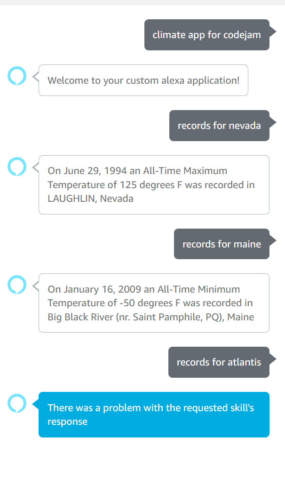
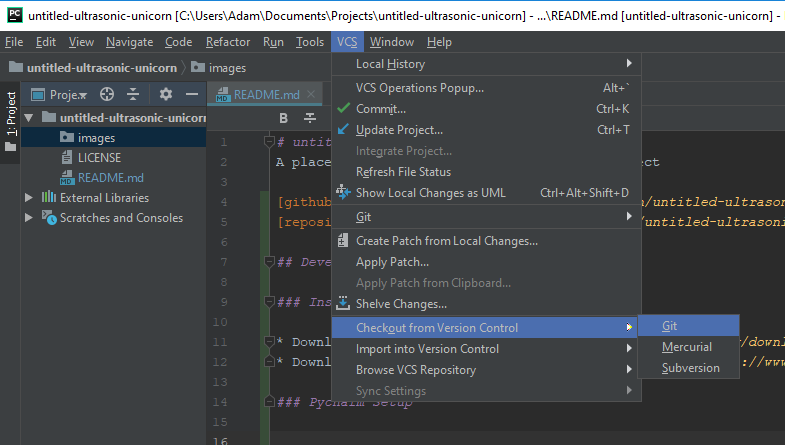
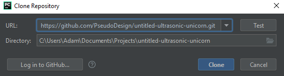
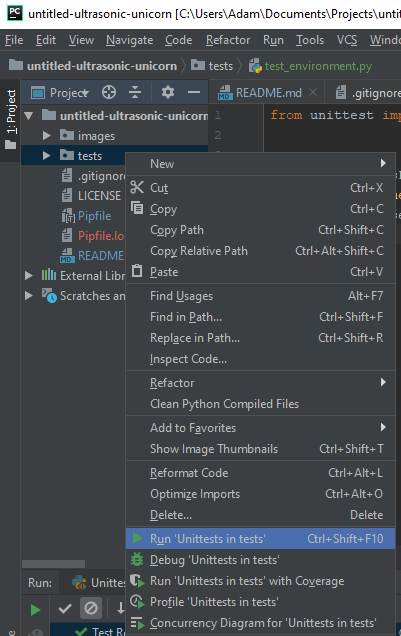

# ultrasonic-unicorn project

[](https://nectr.dev/job/ultrasonic-unicorn/)

This projects goal was to deliver some climate news via an Alexa enabled device. The first versions functionality was to
load an database of extreme weather events. The user asks for records from that state and the device returns a random
record as speech to the end device. This interaction was to be the first of a few. 

Example interaction fromt he Alexa Developers Test Console which is a fully compliant "Alexa Device" used for testing:




Should you choose to setup your own version of this skill in the alexa console you can start with the contents of `alexa.json`

However please note that the skill presently isn't passing the verification steps required by Amazon. 

[github_page]: https://github.com/PseudoDesign/code-jam-5
[repository]: https://github.com/PseudoDesign/code-jam-5.git

## Development Environment Setup

### Install Required Software

* Download and install [Python 3.7](https://www.python.org/downloads/)
* Download and install a recent version of [PyCharm](https://www.jetbrains.com/pycharm/download)
* Download and install [git](https://git-scm.com/downloads)

### PyCharm Setup

#### Clone the Repository

* From the PyCharm menu bar, select `VCS->Checkout from Version Control->git`:



* Click `Log in to GitHub...` and provide your login information

* Paste the link to the repository:
 `https://github.com/PseudoDesign/code-jam-5.git` and select `Clone`



#### Open the project subdirectory
We need to work from a subdirectory with our project files.  Open the `ultrasonic_unicorns`
subdirectory in PyCharm.

#### Pipenv Setup

Follow the instructions provided on [PyCharm's website](https://www.jetbrains.com/help/pycharm/pipenv.html).
The Pipfile already exists for this project.

#### Verify Development Environment

The most straightfoward way to make sure your environment is set up correctly is to run the unit tests.

Right-click the "tests" directory, and select `Run Unittests in tests`:




## Development Practices

### Work Tracking

We're using a [Trello board](https://trello.com/b/7Ps4Girs/codejam-summer-2019) to track work for this project

### Unit Tests

"*Untested Code is Broken Code*" - Alan Turing (Probably)

Bugs happen, and tests are a great way to catch them before they turn 
into embarrassing demos.  [Test Driven Development](https://en.wikipedia.org/wiki/Test-driven_development)
is a software development practice where (in general) developers write tests for
their software before writing the software itself.

Python's [unittest](https://www.geeksforgeeks.org/unit-testing-python-unittest/) 
library is well suited for Test Driven Development.  Unit testing can be challenging;
if you haven't developed this way before, expect to learn a lot of lessons along the way.


### Version Control

Git and GitHub have great interfaces for managing branches and pull requests.

#### Managing Git Branches

Any work done for the project should be done in a git branch to allow the team to easily review your changes.

PyCharm has great [branch support](https://www.jetbrains.com/help/pycharm/manage-branches.html), 
or you can simply use the command line to manage your branches.  

#### Committing Changes to the Repository

Once you've pushed your branch to the repository, you can open a pull request on
the project's [GitHub Page][github_page].  This will allow the rest of the team to
review code and ensure that the unit tests are passing before committing it to the master branch.


### Local Testing ###
While testing an Amazon alexa skill locally is important. It isn't that impressive, as you are not actually talking to
a computer. 

To test your code locally please run:

`python-lambda-local -f lambda_handler lambda_function.py tests/ohio.json` 

You should see something similar to the following. This is the json response that an echo/alexa device needs to receive 
some JSON. This JSON is the parsed 'outputSpeech' and 'text' data is then spoken. 
``` 
[root - INFO - 2019-07-05 15:23:30,307] Event: {'version': '1.0', 'session': {'new': False, 'sessionId': '', 'application': {'applicationId': ''}, 'user': {'userId': ''}}, 'context': {'System': {'application': {'applicationId': ''}, 'user': {'userId': ''}, 'device': {'deviceId': '', 'supportedInterfaces': {}}, 'apiEndpoint': 'https://api.amazonalexa.com', 'apiAccessToken': ''}, 'Viewport': {'experiences': [{'arcMinuteWidth': 246, 'arcMinuteHeight': 144, 'canRotate': False, 'canResize': False}], 'shape': 'RECTANGLE', 'pixelWidth': 1024, 'pixelHeight': 600, 'dpi': 160, 'currentPixelWidth': 1024, 'currentPixelHeight': 600, 'touch': ['SINGLE'], 'video': {'codecs': ['H_264_42', 'H_264_41']}}}, 'request': {'type': 'IntentRequest', 'requestId': '', 'timestamp': '2019-06-29T19:11:08Z', 'locale': 'en-US', 'intent': {'name': 'extreme', 'confirmationStatus': 'NONE', 'slots': {'state': {'name': 'state', 'value': 'Ohio', 'confirmationStatus': 'NONE', 'source': 'USER'}}}}}
[root - INFO - 2019-07-05 15:23:30,307] START RequestId: c190d9ec-96d2-4ed2-8ab0-8eab81ed102a
Incoming request...
{'name': 'extreme', 'confirmationStatus': 'NONE', 'slots': {'state': {'name': 'state', 'value': 'Ohio', 'confirmationStatus': 'NONE', 'source': 'USER'}}}
[root - INFO - 2019-07-05 15:23:30,309] END RequestId: c190d9ec-96d2-4ed2-8ab0-8eab81ed102a
[root - INFO - 2019-07-05 15:23:30,310] RESULT:
{'version': '1.0', 'sessionAttributes': {}, 'response': {'outputSpeech': {'type': 'PlainText', 'text': 'On November 14, 1996  an All-Time Maximum Snow Depth of 47 inches was recorded in CHARDON, Ohio '}, 'card': {'type': 'Simple', 'title': 'SessionSpeechlet - Extreme Weather', 'content': 'SessionSpeechlet - On November 14, 1996  an All-Time Maximum Snow Depth of 47 inches was recorded in CHARDON, Ohio '}, 'reprompt': {'outputSpeech': {'type': 'PlainText', 'text': 'You never responded to the first test message. Sending another one.'}}, 'shouldEndSession': False}}
[root - INFO - 2019-07-05 15:23:30,310] REPORT RequestId: c190d9ec-96d2-4ed2-8ab0-8eab81ed102a  Duration: 2.41 ms
```
 
 tests/ohio.json is the valid input json file that an http endpoint should expect to receive and process. Because our http
 endpoint runs as an AWS Lambda function we need to to use a python-lambda-local module to execute the environment locally.
 
 If you wish to see records from other states when testing locally please simply change the value of the 
 state in the snippet below on your inputted json file.
 ```
  "slots": {
        "state": {
          "name": "state",
          "value": "California",
 ```